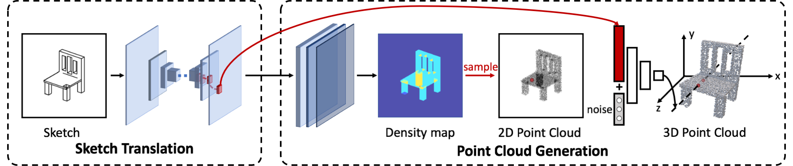

# SketchSampler

<p align="center">
    <a href="https://pytorch.org/get-started/locally/"></a>
    <a href="https://pytorchlightning.ai/"></a>
    <a href="https://hydra.cc/"></a>
    <a href="https://wandb.ai/site"></a>
    <a href="https://github.com/lucmos/nn-template"></a>
</p>

Official PyTorch implementation of paper SketchSampler: Sketch-based 3D Reconstruction via View-dependent Depth
Sampling, accepted by ECCV 2022.



## Environments

- `git clone https://github.com/cjeen/sketchsampler.git`
- Python>=3.6
- PyTorch>=1.4
- Install dependencies: `pip install -r requirements.txt`

## Training & Evaluation

- Download [dataset](https://drive.google.com/file/d/1GlDYDmD1miWOaFwwc9mE6XY19BKFGjFB/view?usp=sharing) and extract it:

```
tar zxvf sketchsampler_dataset.tar.gz
```

- Replace 'PLACEHOLDER' in '.env':
    - 'PROJECT_ROOT' is the absolute path of this project.
    - 'SKETCH_PATH', 'SHAPENET_PT_PATH', 'SHAPENET_CAM_PATH' and 'SHAPENET_DENSITY_PATH' are absolute paths of the
      dataset.
    - 'TRAIN_LIST' and 'TEST_LIST' are absolute paths of the text files for data split.
    - An example:
      ```
      export PROJECT_ROOT="/home/user/sketchsampler"
      
      export SKETCH_PATH="/home/user/sketchsampler_dataset/linedrawing"
      export SHAPENET_PT_PATH="/home/user/sketchsampler_dataset/pt"
      export SHAPENET_CAM_PATH="/home/user/sketchsampler_dataset/camera"
      export SHAPENET_DENSITY_PATH="/home/user/sketchsampler_dataset/density_map"
      
      export TRAIN_LIST="/home/user/sketchsampler_dataset/split/train_list.txt"
      export TEST_LIST="/home/user/sketchsampler_dataset/split/test_list.txt"
      
      export WANDB_MODE=dryrun
      ```

- Run the python script to launch the task:

```
python ./src/trainval.py
```

## Configuration

We use [hydra](https://hydra.cc/) to manage the configurations:

```
.
├── conf
   ├── sketchsampler.yaml    # experiment configuration
   ├── data                  # dataset configuration(num_workers, batch_size, etc.)
   ├── hydra                 # job configuration
   ├── logging               # logging configuration(logging frequency, wanbd configuration, etc.)
   ├── model                 # model configuration
   ├── optim                 # optimizer configuration(optimizer type, learning rate, etc.)
   └── train                 # training configuration(gpus, loss weights, epochs, etc.)
```

Please feel free to modify any configuration to achieve better results!

## Logging

We adopt [Weights and Biases](https://wandb.ai/home) as the logging framework. If you want to analyze the results,
please install wandb following official document and replace ```USER``` in `./config/logging/default.yaml` by your own
username. ```export WANDB_MODE=dryrun``` in ```.env``` can be also modified and more options can be
found [here](https://docs.wandb.ai/library/environment-variables).

## Contact

If you have any questions about the implementation or the paper, please feel free to open an issue or contact me
at <gaochenjian@buaa.edu.cn>.